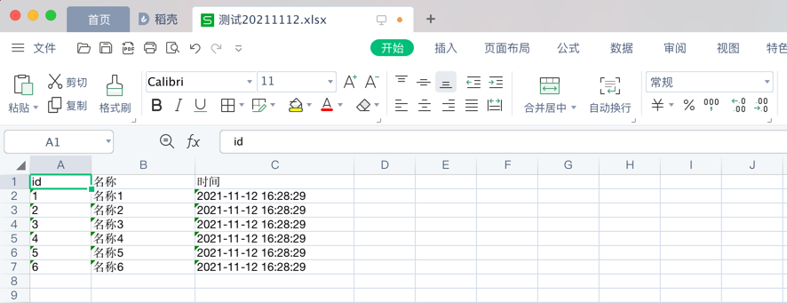

# quick-excel

PHP快速生成excel文档(注:必须安装composer require phpoffice/phpspreadsheet)

- 示例代码

```
<?php
require '../vendor/autoload.php';
include '../src/QuickExcel.php';
//表头
$excelHead = ['id', '名称', '时间'];
$data = [];
for ($i = 0; $i <= 5; $i++) {
    $data[$i] = [
        $i + 1,
        '名称' . ($i + 1),
        date('Y-m-d H:i:s', time())
    ];
}
$fileName = '测试';
$excel = new QuickExcel();
$savePath = './'; //保存在当前文件夹 为空的话直接下载
$fileName = $excel::excelOut($excelHead, $data, $fileName,'./'); //返回fileName

```

- 如图:


